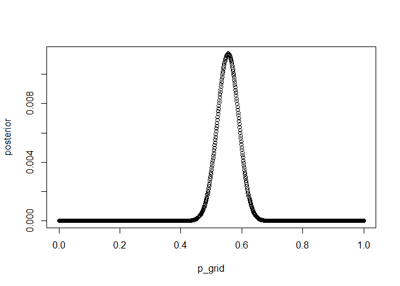
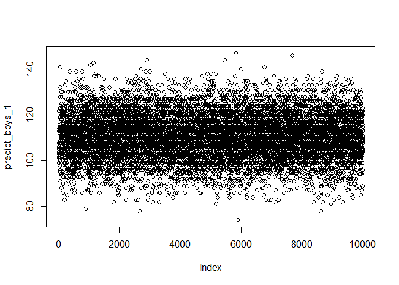
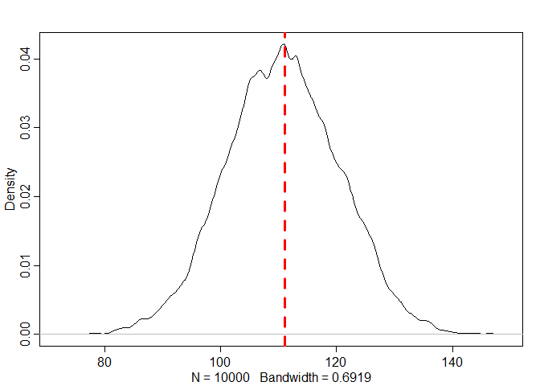
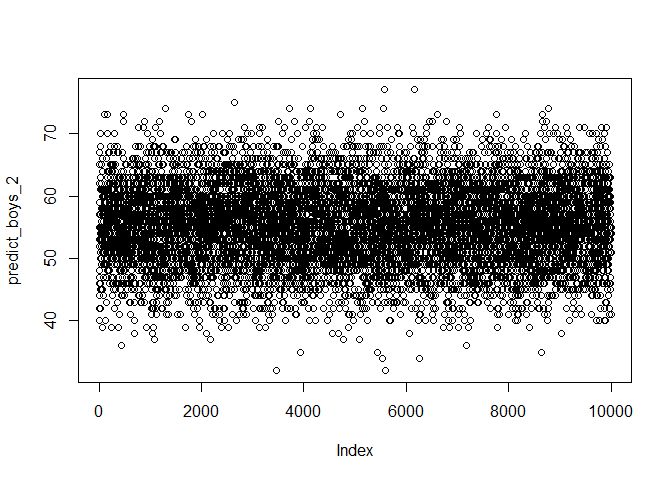
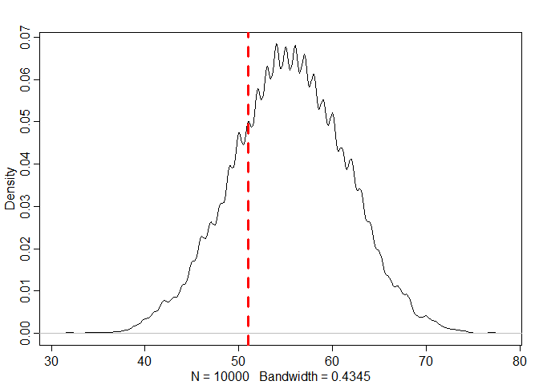
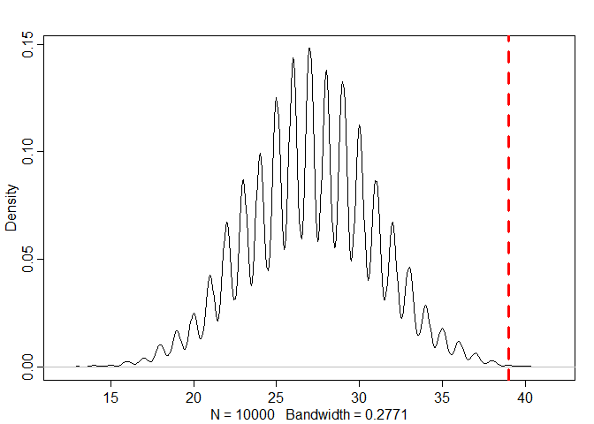

Assignment1\_B04704016林家毅
================

The below data indicate the gender (male=1, female=0) of officially reported first and second born children in 100 two-child families. birth1 &lt;- c(1,0,0,0,1,1,0,1,0,1,0,0,1,1,0,1,1,0,0,0,1,0,0,0,1, 0,0,0,0,1,1,1,0,1,0,1,1,1,0,1,0,1,1,0,1,0,0,1,1,0, 1,0,0,0,0,0,0,0,1,1,0,1,0,0,1,0,0,0,1,0,0,1,1,1,1, 0,1,0,1,1,1,1,1,0,0,1,0,1,1,0,1,0,1,1,1,0,1,1,1,1) birth2 &lt;- c(0,1,0,1,0,1,1,1,0,0,1,1,1,1,1,0,0,1,1,1,0,0,1,1,1, 0,1,1,1,0,1,1,1,0,1,0,0,1,1,1,1,0,0,1,0,1,1,1,1,1, 1,1,1,1,1,1,1,1,1,1,1,0,1,1,0,1,1,0,1,1,1,0,0,0,0, 0,0,1,0,0,0,1,1,0,0,1,0,0,1,1,0,0,0,1,1,1,0,0,0,0) So for example, the first family in the data reported a boy (1) and then a girl (0). The second family reported a girl (0) and then a boy (1). The third family reported two girls. Use these vectors as data. So for example to compute the total number of boys born across all of these births, you could use: sum(birth1) + sum(birth2)

Question 1
==========

Using grid approximation, compute the posterior distribution for the probability of a birth being a boy. Assume a uniform prior probability. Which parameter value maximizes the posterior probability?

    library(tidyverse)
    library(tidybayes)
    library(rethinking)

``` r
birth1 <- c(1,0,0,0,1,1,0,1,0,1,0,0,1,1,0,1,1,0,0,0,1,0,0,0,1,
            0,0,0,0,1,1,1,0,1,0,1,1,1,0,1,0,1,1,0,1,0,0,1,1,0,
            1,0,0,0,0,0,0,0,1,1,0,1,0,0,1,0,0,0,1,0,0,1,1,1,1,
            0,1,0,1,1,1,1,1,0,0,1,0,1,1,0,1,0,1,1,1,0,1,1,1,1)

birth2 <- c(0,1,0,1,0,1,1,1,0,0,1,1,1,1,1,0,0,1,1,1,0,0,1,1,1,
            0,1,1,1,0,1,1,1,0,1,0,0,1,1,1,1,0,0,1,0,1,1,1,1,1,
            1,1,1,1,1,1,1,1,1,1,1,0,1,1,0,1,1,0,1,1,1,0,0,0,0,
            0,0,1,0,0,0,1,1,0,0,1,0,0,1,1,0,0,0,1,1,1,0,0,0,0)

p_grid <- seq( from = 0, to = 1, length.out = 1000 )
prior <- rep( 1, 1000 )

prob_data <- dbinom(( sum( birth1 ) + sum( birth2 )), size = 200, prob = p_grid )

posterior <- prob_data * prior
posterior <- posterior / sum( posterior )

answer_1 <- round( p_grid[ which.max( posterior ) ], 3)
plot( posterior ~ p_grid )
```



    ## The parameter value which maximizes the posterior probability: p = 0.555

Question 2
==========

Using the sample() function, draw 10,000 random parameter values from the posterior distribution you calculated above. Use these samples to estimate the 50%, 89%, and 97% highest posterior density intervals. (hint: use mode\_hdi() in tidybayes packages)

``` r
set.seed( 100 )
samples <- sample( p_grid, prob = posterior, size = 10000, replace = TRUE )
answer_2 <- mode_hdi( samples, .width = c( 0.5, 0.89, 0.97 ))
```

    ## Posterior density intervals:

    ##           y      ymin      ymax .width .point .interval
    ## 1 0.5552446 0.5265265 0.5725726   0.50   mode       hdi
    ## 2 0.5552446 0.4994995 0.6076076   0.89   mode       hdi
    ## 3 0.5552446 0.4824825 0.6296296   0.97   mode       hdi

Question 3
==========

Use rbinom function to simulate 10,000 replicates of 200 births. You should end up with 10,000 numbers, each one a count of boys out of 200 births. Compare the distribution of predicted numbers of boys to the actual count in the data (111 boys out of 200 births). There are many good ways to visualize the simulations, but the dens command (part of the rethinking package) is probably the easiest way in this case. Does it look like the model fits the data well? That is, does the distribution of predictions include the actual observation as a central, likely outcome?

``` r
predict_boys_1 <- rbinom( 1e4, size = 200, prob = samples )
plot( predict_boys_1 )
```



``` r
dens( predict_boys_1 )
abline( v = sum( birth1 ) + sum( birth2 ) , col = "red", lwd = 3, lty = 2 )
```



    ## The posterior probability model seems to fit the data well, since the distribution of predictions include the actual observation as a central.

Question 4
==========

Now compare 10,000 counts of boys from 100 simulated first borns only to the number of boys in the first births, birth1. How does the model look in this light?

``` r
predict_boys_2 <- rbinom( 1e4, size = 100, prob = samples )
plot( predict_boys_2 )
```



``` r
dens( predict_boys_2 )
abline( v = sum( birth1 ) , col = "red", lwd = 3, lty = 2 )
```



    ## The posterior probability model seems to fit the data badly, since the distribution of predictions do not include the actual observation as a central.

Question 5
==========

The model assumes that sex of first and second births are independent. To check this assumption, focus now on second births that followed female first borns. Compare 10,000 simulated counts of boys to only those second births that followed girls. To do this correctly, you need to count the number of first borns who were girls and simulate that many births, 10,000 times. Compare the counts of boys in your simulations to the actual observed count of boys following girls. How does the model look in this light? Any guesses what is going on in these data?

``` r
female_first_borns <- c( which( birth1 == 0 ))
cat( "The following families have a girl as the first child:", female_first_borns)
```

    ## The following families have a girl as the first child: 2 3 4 7 9 11 12 15 18 19 20 22 23 24 26 27 28 29 33 35 39 41 44 46 47 50 52 53 54 55 56 57 58 61 63 64 66 67 68 70 71 76 78 84 85 87 90 92 96

``` r
cat( "Number of families:", length(female_first_borns) )
```

    ## Number of families: 49

``` r
second_birth_following_female <- birth2[ female_first_borns ]
cat( "The second child of these families have the following genders:", second_birth_following_female)
```

    ## The second child of these families have the following genders: 1 0 1 1 0 1 1 1 1 1 1 0 1 1 0 1 1 1 1 1 1 1 1 1 1 1 1 1 1 1 1 1 1 1 1 1 1 1 0 1 1 0 1 0 0 0 1 0 1

``` r
second_male_simulation <- rbinom(n = 1e4, size = length(second_birth_following_female), prob = samples)
dens(second_male_simulation)
abline(v = sum( second_birth_following_female ), col = "red", lwd = 3, lty = 2 )
```



    ## The posterior probability model do not fit the data well, one of the reasons might be that the sample size of data is too small.
