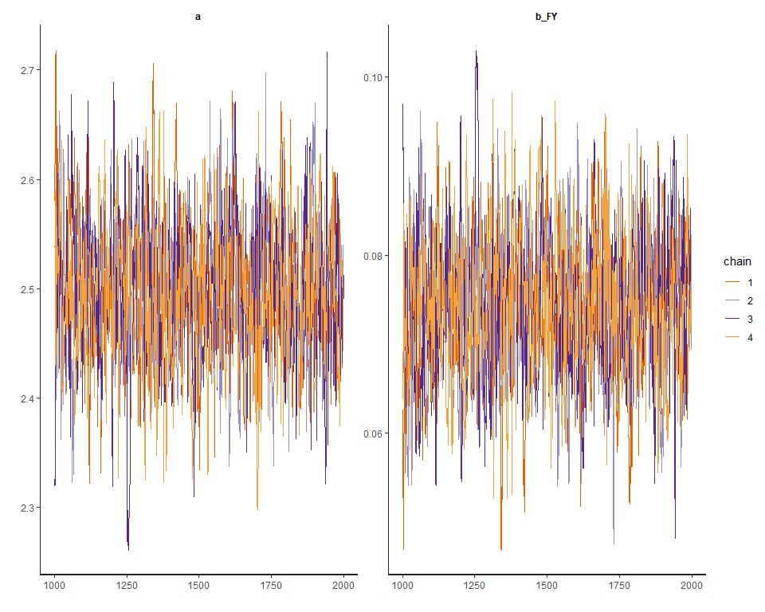

Assignment7\_B04704016林家毅
================

Question 1
==========

``` r
# Load data
data( "Hurricanes" )
data <- Hurricanes; rm( Hurricanes )
str( data )
```

    ## 'data.frame':    92 obs. of  8 variables:
    ##  $ name        : Factor w/ 83 levels "Able","Agnes",..: 38 77 1 9 47 20 40 60 27 33 ...
    ##  $ year        : int  1950 1950 1952 1953 1953 1954 1954 1954 1955 1955 ...
    ##  $ deaths      : int  2 4 3 1 0 60 20 20 0 200 ...
    ##  $ category    : int  3 3 1 1 1 3 3 4 3 1 ...
    ##  $ min_pressure: int  960 955 985 987 985 960 954 938 962 987 ...
    ##  $ damage_norm : int  1590 5350 150 58 15 19321 3230 24260 2030 14730 ...
    ##  $ female      : int  1 0 0 1 1 1 1 1 1 1 ...
    ##  $ femininity  : num  6.78 1.39 3.83 9.83 8.33 ...

``` r
# Create data list for the stan model
model.data <- list(
  N = NROW( data ),
  D = data$deaths,
  C = data$category,
  MP = scale( data$min_pressure )[ ,1],
  DN = scale( data$damage_norm )[ ,1],
  FE = data$female,
  FY = data$femininity
)
str( model.data )
```

    ## List of 7
    ##  $ N : int 92
    ##  $ D : int [1:92] 2 4 3 1 0 60 20 20 0 200 ...
    ##  $ C : int [1:92] 3 3 1 1 1 3 3 4 3 1 ...
    ##  $ MP: num [1:92] -0.258 -0.52 1.054 1.158 1.054 ...
    ##  $ DN: num [1:92] -0.439 -0.148 -0.55 -0.558 -0.561 ...
    ##  $ FE: int [1:92] 1 0 0 1 1 1 1 1 1 1 ...
    ##  $ FY: num [1:92] 6.78 1.39 3.83 9.83 8.33 ...

``` r
# Model code
stan.model <- "
data{
  int<lower=1> N;
  int D[N];
  real FY[N];
}
parameters{
  real a;
}
model{
  vector[N] lamda;
  a ~ uniform( -30, 30 );
  for ( i in 1:N ) {
    lamda[i] = a;
  }
  D ~ poisson_log( lamda );
}
generated quantities{
  vector[N] log_lik;
  vector[N] lamda;
  for ( i in 1:N ) {
    lamda[i] = a;
    log_lik[i] = poisson_log_lpmf( D[i] | lamda[i] );
  }
}
"

# Fit stan model with model code and model data
fit.stan.0 <- stan( model_code=stan.model , data=model.data , 
                    chains=4 , cores=4 , iter=2000 )

# Traceplot
traceplot( fit.stan.0 , pars=c("log_lik","lamda","lp__"), include=FALSE )
```


``` r
# Show results
print( fit.stan.0 , probs=c(0.055,0.945) , pars=c("log_lik","lamda","lp__"), include=FALSE )
```

    ## Inference for Stan model: 9ebda01fac82b936d9bfeca36a19d78f.
    ## 4 chains, each with iter=2000; warmup=1000; thin=1; 
    ## post-warmup draws per chain=1000, total post-warmup draws=4000.
    ## 
    ##   mean se_mean   sd 5.5% 94.5% n_eff Rhat
    ## a 3.03       0 0.02 2.99  3.06  1317    1
    ## 
    ## Samples were drawn using NUTS(diag_e) at Sun Apr 12 13:56:00 2020.
    ## For each parameter, n_eff is a crude measure of effective sample size,
    ## and Rhat is the potential scale reduction factor on split chains (at 
    ## convergence, Rhat=1).

``` r
# Plot coeftab
plot( fit.stan.0 , pars=c("log_lik","lamda","lp__"), include=FALSE )
```


``` r
# Pairs plot
pairs( fit.stan.0 , pars=c("log_lik","lamda","lp__"), include=FALSE )
```


``` r
# Draw posterior
post.0 <- as.data.frame( fit.stan.0 )

# Recreate lamda and simulate it with new data
f_lamda <- function(x) exp(post.0$a)
femininity_new <- seq( from=min(data$femininity) , to=max(data$femininity) , length.out=30 )

lamda <- 
  sapply(femininity_new, f_lamda) %>%
  as_tibble() %>%
  rename_all(function(x) femininity_new) %>%
  mutate(Iter = row_number()) %>%
  gather(femininity, deaths, -Iter) %>%
  group_by(femininity) %>%
  mutate(hpdi_l = quantile(deaths, probs = 0.055),
         hpdi_h = quantile(deaths, probs = 0.945)) %>%
  mutate(mu = mean(deaths)) %>%
  ungroup() %>%
  mutate(femininity = as.numeric(femininity))
```

    ## Warning: `as_tibble.matrix()` requires a matrix with column names or a `.name_repair` argument. Using compatibility `.name_repair`.
    ## This warning is displayed once per session.

``` r
# Plot raw data and model estimate of lamda
p <- ggplot() 
p0 <- p + 
  geom_point(data = data,
             aes(femininity, deaths), 
             shape = 1, color = 'dodgerblue') +
  geom_ribbon(data = lamda,
              aes(x = femininity, ymin = hpdi_l, ymax = hpdi_h), alpha = .5) +
  geom_line(data = lamda,
            aes(x = femininity, y = mu)) +
  ggtitle("Intercept only")

# Model code
stan.model <- "
data{
  int<lower=1> N;
  int D[N];
  real FY[N];
}
parameters{
  real a;
  real b_FY;
}
model{
  vector[N] lamda;
  b_FY ~ uniform( -15 , 15 );
  a ~ uniform( -30, 30 );
  for ( i in 1:N ) {
    lamda[i] = a + b_FY * FY[i];
  }
  D ~ poisson_log( lamda );
}
generated quantities{
  vector[N] log_lik;
  vector[N] lamda;
  for ( i in 1:N ) {
    lamda[i] = a + b_FY * FY[i];
    log_lik[i] = poisson_log_lpmf( D[i] | lamda[i] );
  }
}
"

# Fit stan model with model code and model data
fit.stan.1 <- stan( model_code=stan.model , data=model.data , 
              chains=4 , cores=4 , iter=2000 )

# Traceplot
traceplot( fit.stan.1 , pars=c("log_lik","lamda","lp__"), include=FALSE )
```



``` r
# Show results
print( fit.stan.1 , probs=c(0.055,0.945) , pars=c("log_lik","lamda","lp__"), include=FALSE )
```

    ## Inference for Stan model: ce66ef3ed6babaf5df357e697b495a94.
    ## 4 chains, each with iter=2000; warmup=1000; thin=1; 
    ## post-warmup draws per chain=1000, total post-warmup draws=4000.
    ## 
    ##      mean se_mean   sd 5.5% 94.5% n_eff Rhat
    ## a    2.50       0 0.06 2.40  2.60   783    1
    ## b_FY 0.07       0 0.01 0.06  0.09   804    1
    ## 
    ## Samples were drawn using NUTS(diag_e) at Sun Apr 12 13:57:05 2020.
    ## For each parameter, n_eff is a crude measure of effective sample size,
    ## and Rhat is the potential scale reduction factor on split chains (at 
    ## convergence, Rhat=1).

``` r
# Plot coeftab
plot( fit.stan.1 , pars=c("log_lik","lamda","lp__"), include=FALSE )
```


``` r
# Pairs plot
pairs( fit.stan.1 , pars=c("log_lik","lamda","lp__"), include=FALSE )
```


``` r
# Draw posterior
post.1 <- as.data.frame( fit.stan.1 )

# Recreate lamda and simulate it with new data
f_lamda <- function(x) exp(post.1$a + post.1$b_FY * x)
femininity_new <- seq( from=min(data$femininity) , to=max(data$femininity) , length.out=30 )

lamda <- 
  sapply(femininity_new, f_lamda) %>%
  as_tibble() %>%
  rename_all(function(x) femininity_new) %>%
  mutate(Iter = row_number()) %>%
  gather(femininity, deaths, -Iter) %>%
  group_by(femininity) %>%
  mutate(hpdi_l = quantile(deaths, probs = 0.055),
         hpdi_h = quantile(deaths, probs = 0.945)) %>%
  mutate(mu = mean(deaths)) %>%
  ungroup() %>%
  mutate(femininity = as.numeric(femininity))

# Plot raw data and model estimate of lamda
p <- ggplot() 
p1 <- p + 
  geom_point(data = data,
             aes(femininity, deaths), 
             shape = 1, color = 'dodgerblue') +
  geom_ribbon(data = lamda,
              aes(x = femininity, ymin = hpdi_l, ymax = hpdi_h), alpha = .5) +
  geom_line(data = lamda,
            aes(x = femininity, y = mu)) +
  ggtitle("Femininity as predictor")

grid.arrange(p0, p1, nrow = 2)
```


Conclusion
----------

The association between femininity of names and deaths is quite obvious that if we add femininity as a predictor variable, it helps to predict deaths more properly. However, despite the model fits well on most of the cases, it fit poorly on the cases which have high variation.

Question 2
==========

``` r
# Model code
stan.model <- "
data{
  int<lower=1> N;
  int D[N];
  real FY[N];
}
parameters{
  real<lower=0> phi;
  real a;
  real b_FY;
}
model{
  vector[N] lamda;
  phi ~ cauchy( 0 , 2 );
  b_FY ~ uniform( -30 , 30 );
  a ~ uniform( -30, 30 );
  for ( i in 1:N ) {
    lamda[i] = a + b_FY * FY[i];
  }
  D ~ neg_binomial_2_log( lamda , phi );
}
generated quantities{
  vector[N] log_lik;
  vector[N] lamda;
  for ( i in 1:N ) {
    lamda[i] = a + b_FY * FY[i];
    log_lik[i] = neg_binomial_2_log_lpmf( D[i] | lamda[i] , phi );
  }
}
"
# Fit stan model with model code and model data
fit.stan.2 <- stan( model_code=stan.model , data=model.data , 
                    chains=4 , cores=4 , iter=2000 )

# Traceplot
traceplot( fit.stan.2 , pars=c("log_lik","lamda","lp__"), include=FALSE )
```


``` r
# Show results
print( fit.stan.2 , probs=c(0.055,0.945) , pars=c("log_lik","lamda","lp__"), include=FALSE )
```

    ## Inference for Stan model: 31935db4aab5bf20580fba3f06e6e13d.
    ## 4 chains, each with iter=2000; warmup=1000; thin=1; 
    ## post-warmup draws per chain=1000, total post-warmup draws=4000.
    ## 
    ##      mean se_mean   sd  5.5% 94.5% n_eff Rhat
    ## phi  0.46    0.00 0.06  0.36  0.56  2164    1
    ## a    2.57    0.01 0.35  2.03  3.15  1904    1
    ## b_FY 0.07    0.00 0.05 -0.01  0.14  1912    1
    ## 
    ## Samples were drawn using NUTS(diag_e) at Sun Apr 12 13:58:10 2020.
    ## For each parameter, n_eff is a crude measure of effective sample size,
    ## and Rhat is the potential scale reduction factor on split chains (at 
    ## convergence, Rhat=1).

``` r
# Plot coeftab
plot( fit.stan.2 , pars=c("log_lik","lamda","lp__"), include=FALSE )
```


``` r
# Pairs plot
pairs( fit.stan.2 , pars=c("log_lik","lamda","lp__"), include=FALSE )
```


``` r
# Draw posterior
post.2 <- as.data.frame( fit.stan.2 )

# Recreate lamda and simulate it with new data
f_lamda <- function(x) exp(post.2$a + post.2$b_FY * x)
femininity_new <- seq( from=min(data$femininity) , to=max(data$femininity) , length.out=30 )

lamda <- 
  sapply(femininity_new, f_lamda) %>%
  as_tibble() %>%
  rename_all(function(x) femininity_new) %>%
  mutate(Iter = row_number()) %>%
  gather(femininity, deaths, -Iter) %>%
  group_by(femininity) %>%
  mutate(hpdi_l = quantile(deaths, probs = 0.055),
         hpdi_h = quantile(deaths, probs = 0.945)) %>%
  mutate(mu = mean(deaths)) %>%
  ungroup() %>%
  mutate(femininity = as.numeric(femininity))

# Plot raw data and model estimate of lamda
p <- ggplot() 
p2 <- p + 
  geom_point(data = data,
             aes(femininity, deaths), 
             shape = 1, color = 'dodgerblue') +
  geom_ribbon(data = lamda,
              aes(x = femininity, ymin = hpdi_l, ymax = hpdi_h), alpha = .5) +
  geom_line(data = lamda,
            aes(x = femininity, y = mu)) +
  ggtitle("Femininity as predictor (gamma Poisson)")

grid.arrange(p1, p2, nrow = 2)
```


Conclusion
----------

Since the gamma-Poisson distribution assumes that the data has more variation, the coefficient of femininity would have wider range, and thus it overlaps zero.

Question 3
==========

``` r
# Create data list for the stan model
model.data <- list(
  N = NROW( data ),
  D = data$deaths,
  C = data$category,
  MP = scale( data$min_pressure )[ ,1],
  DN = scale( data$damage_norm )[ ,1],
  FE = data$female,
  FY = scale( data$femininity )[ ,1]
)
str( model.data )
```

    ## List of 7
    ##  $ N : int 92
    ##  $ D : int [1:92] 2 4 3 1 0 60 20 20 0 200 ...
    ##  $ C : int [1:92] 3 3 1 1 1 3 3 4 3 1 ...
    ##  $ MP: num [1:92] -0.258 -0.52 1.054 1.158 1.054 ...
    ##  $ DN: num [1:92] -0.439 -0.148 -0.55 -0.558 -0.561 ...
    ##  $ FE: int [1:92] 1 0 0 1 1 1 1 1 1 1 ...
    ##  $ FY: num [1:92] -0.000935 -1.670758 -0.913314 0.94587 0.481074 ...

``` r
stan.model <- "
data{
  int<lower=1> N;
  int D[N];
  real FY[N];
  real MP[N];
}
parameters{
  real<lower=0> phi;
  real a;
  real b_FY_MP;
}
model{
  vector[N] lamda;
  phi ~ cauchy( 0 , 2 );
  b_FY_MP ~ uniform( -30 , 30 );
  a ~ uniform( -30, 30 );
  for ( i in 1:N ) {
    lamda[i] = a + b_FY_MP * FY[i] * MP[i];
  }
  D ~ neg_binomial_2_log( lamda , phi );
}
generated quantities{
  vector[N] log_lik;
  vector[N] lamda;
  for ( i in 1:N ) {
    lamda[i] = a + b_FY_MP * FY[i] * MP[i];
    log_lik[i] = neg_binomial_2_log_lpmf( D[i] | lamda[i] , phi );
  }
}
"
# Fit stan model with model code and model data
fit.stan.3 <- stan( model_code=stan.model , data=model.data , 
                    chains=4 , cores=4 , iter=2000 )

# Traceplot
traceplot( fit.stan.3 , pars=c("log_lik","lamda","lp__"), include=FALSE )
```


``` r
# Show results
print( fit.stan.3 , probs=c(0.055,0.945) , pars=c("log_lik","lamda","lp__"), include=FALSE )
```

    ## Inference for Stan model: fae55111693c447cac71f7c52c226c54.
    ## 4 chains, each with iter=2000; warmup=1000; thin=1; 
    ## post-warmup draws per chain=1000, total post-warmup draws=4000.
    ## 
    ##          mean se_mean   sd  5.5% 94.5% n_eff Rhat
    ## phi      0.45       0 0.06  0.35  0.55  3822    1
    ## a        3.05       0 0.16  2.80  3.31  3106    1
    ## b_FY_MP -0.07       0 0.13 -0.27  0.13  3831    1
    ## 
    ## Samples were drawn using NUTS(diag_e) at Sun Apr 12 13:59:10 2020.
    ## For each parameter, n_eff is a crude measure of effective sample size,
    ## and Rhat is the potential scale reduction factor on split chains (at 
    ## convergence, Rhat=1).

``` r
# Plot coeftab
plot( fit.stan.3 , pars=c("log_lik","lamda","lp__"), include=FALSE )
```


``` r
# Pairs plot
pairs( fit.stan.3 , pars=c("log_lik","lamda","lp__"), include=FALSE )
```


``` r
stan.model <- "
data{
  int<lower=1> N;
  int D[N];
  real FY[N];
  real DN[N];
}
parameters{
  real<lower=0> phi;
  real a;
  real b_FY_DN;
}
model{
  vector[N] lamda;
  phi ~ cauchy( 0 , 2 );
  b_FY_DN ~ uniform( -30 , 30 );
  a ~ uniform( -30, 30 );
  for ( i in 1:N ) {
    lamda[i] = a + b_FY_DN * FY[i] * DN[i];
  }
  D ~ neg_binomial_2_log( lamda , phi );
}
generated quantities{
  vector[N] log_lik;
  vector[N] lamda;
  for ( i in 1:N ) {
    lamda[i] = a + b_FY_DN * FY[i] * DN[i];
    log_lik[i] = neg_binomial_2_log_lpmf( D[i] | lamda[i] , phi );
  }
}
"
# Fit stan model with model code and model data
fit.stan.4 <- stan( model_code=stan.model , data=model.data , 
                    chains=4 , cores=4 , iter=2000 )

# Traceplot
traceplot( fit.stan.4 , pars=c("log_lik","lamda","lp__"), include=FALSE )
```


``` r
# Show results
print( fit.stan.4 , probs=c(0.055,0.945) , pars=c("log_lik","lamda","lp__"), include=FALSE )
```

    ## Inference for Stan model: 62b873885424d4633e887f3ca7e10c3a.
    ## 4 chains, each with iter=2000; warmup=1000; thin=1; 
    ## post-warmup draws per chain=1000, total post-warmup draws=4000.
    ## 
    ##         mean se_mean   sd  5.5% 94.5% n_eff Rhat
    ## phi     0.45       0 0.06  0.36  0.56  3229    1
    ## a       3.03       0 0.16  2.78  3.29  3573    1
    ## b_FY_DN 0.10       0 0.08 -0.04  0.22  3698    1
    ## 
    ## Samples were drawn using NUTS(diag_e) at Sun Apr 12 14:00:03 2020.
    ## For each parameter, n_eff is a crude measure of effective sample size,
    ## and Rhat is the potential scale reduction factor on split chains (at 
    ## convergence, Rhat=1).

``` r
# Plot coeftab
plot( fit.stan.4 , pars=c("log_lik","lamda","lp__"), include=FALSE )
```


``` r
# Pairs plot
pairs( fit.stan.4 , pars=c("log_lik","lamda","lp__"), include=FALSE )
```


``` r
stan.model <- "
data{
  int<lower=1> N;
  int D[N];
  real FY[N];
  real MP[N];
  real DN[N];
}
parameters{
  real<lower=0> phi;
  real a;
  real b_FY_MP_DN;
}
model{
  vector[N] lamda;
  phi ~ cauchy( 0 , 2 );
  b_FY_MP_DN ~ uniform( -30 , 30 );
  a ~ uniform( -30, 30 );
  for ( i in 1:N ) {
    lamda[i] = a + b_FY_MP_DN * FY[i] * MP[i] * DN[i];
  }
  D ~ neg_binomial_2_log( lamda , phi );
}
generated quantities{
  vector[N] log_lik;
  vector[N] lamda;
  for ( i in 1:N ) {
    lamda[i] = a + b_FY_MP_DN * FY[i] * MP[i] * DN[i];
    log_lik[i] = neg_binomial_2_log_lpmf( D[i] | lamda[i] , phi );
  }
}
"
# Fit stan model with model code and model data
fit.stan.5 <- stan( model_code=stan.model , data=model.data , 
                    chains=4 , cores=4 , iter=2000 )

# Traceplot
traceplot( fit.stan.5 , pars=c("log_lik","lamda","lp__"), include=FALSE )
```


``` r
# Show results
print( fit.stan.5 , probs=c(0.055,0.945) , pars=c("log_lik","lamda","lp__"), include=FALSE )
```

    ## Inference for Stan model: 0f15ef1a30274481a62569cd36897069.
    ## 4 chains, each with iter=2000; warmup=1000; thin=1; 
    ## post-warmup draws per chain=1000, total post-warmup draws=4000.
    ## 
    ##             mean se_mean   sd  5.5% 94.5% n_eff Rhat
    ## phi         0.45       0 0.06  0.36  0.54  3126    1
    ## a           3.06       0 0.17  2.79  3.33  3089    1
    ## b_FY_MP_DN -0.02       0 0.05 -0.09  0.06  2578    1
    ## 
    ## Samples were drawn using NUTS(diag_e) at Sun Apr 12 14:00:56 2020.
    ## For each parameter, n_eff is a crude measure of effective sample size,
    ## and Rhat is the potential scale reduction factor on split chains (at 
    ## convergence, Rhat=1).

``` r
# Plot coeftab
plot( fit.stan.5 , pars=c("log_lik","lamda","lp__"), include=FALSE )
```


``` r
# Pairs plot
pairs( fit.stan.5 , pars=c("log_lik","lamda","lp__"), include=FALSE )
```


``` r
# Calculate WAIC and compare models
log_lik_3 <- extract_log_lik(fit.stan.3, merge_chains = FALSE)
waic_3 <- waic(log_lik_3)
```

    ## Warning: 2 (2.2%) p_waic estimates greater than 0.4. We recommend trying
    ## loo instead.

``` r
log_lik_4 <- extract_log_lik(fit.stan.4, merge_chains = FALSE)
waic_4 <- waic(log_lik_4)
```

    ## Warning: 4 (4.3%) p_waic estimates greater than 0.4. We recommend trying
    ## loo instead.

``` r
log_lik_5 <- extract_log_lik(fit.stan.5, merge_chains = FALSE)
waic_5 <- waic(log_lik_5)
```

    ## Warning: 4 (4.3%) p_waic estimates greater than 0.4. We recommend trying
    ## loo instead.

``` r
compare_model <- loo::compare(waic_3, waic_4, waic_5)
compare_model
```

    ##        elpd_diff se_diff elpd_waic p_waic waic  
    ## waic_4    0.0       0.0  -355.8       4.6  711.6
    ## waic_5   -0.4       1.2  -356.2       4.3  712.5
    ## waic_3   -0.7       2.1  -356.5       4.8  712.9

``` r
# Draw posterior
post.4 <- as.data.frame( fit.stan.4 )
data$femininity_scale <- scale( data$femininity )[ , 1]

# Recreate lamda and simulate it with new data (Male)
f_lamda <- function(x) exp(post.4$a + post.4$b_FY_DN * mean(data[ data$female==0 , ]$femininity_scale) * x)
damage_norm_scale <- scale(data$damage_norm)[,1]
damage_norm_new <- seq( from=min(damage_norm_scale) , to=max(damage_norm_scale) , length.out=30 )

lamda <- 
  sapply(damage_norm_new, f_lamda) %>%
  as_tibble() %>%
  rename_all(function(x) damage_norm_new) %>%
  mutate(Iter = row_number()) %>%
  gather(damage_norm, deaths, -Iter) %>%
  group_by(damage_norm) %>%
  mutate(hpdi_l = quantile(deaths, probs = 0.055),
         hpdi_h = quantile(deaths, probs = 0.945)) %>%
  mutate(mu = mean(deaths)) %>%
  ungroup() %>%
  mutate(damage_norm = as.numeric(damage_norm))

# Plot raw data and model estimate of lamda
p <- ggplot() 
p4_m <- p + 
  geom_ribbon(data = lamda,
              aes(x = damage_norm, ymin = hpdi_l, ymax = hpdi_h), alpha = .5) +
  geom_line(data = lamda,
            aes(x = damage_norm, y = mu)) +
  ggtitle("Counterfactual Plot (Male)")

# Recreate lamda and simulate it with new data (Female)
f_lamda <- function(x) exp(post.4$a + post.4$b_FY_DN * mean(data[ data$female==1 , ]$femininity_scale) * x)
damage_norm_scale <- scale(data$damage_norm)[,1]
damage_norm_new <- seq( from=min(damage_norm_scale) , to=max(damage_norm_scale) , length.out=30 )

lamda <- 
  sapply(damage_norm_new, f_lamda) %>%
  as_tibble() %>%
  rename_all(function(x) damage_norm_new) %>%
  mutate(Iter = row_number()) %>%
  gather(damage_norm, deaths, -Iter) %>%
  group_by(damage_norm) %>%
  mutate(hpdi_l = quantile(deaths, probs = 0.055),
         hpdi_h = quantile(deaths, probs = 0.945)) %>%
  mutate(mu = mean(deaths)) %>%
  ungroup() %>%
  mutate(damage_norm = as.numeric(damage_norm))

# Plot raw data and model estimate of lamda
p <- ggplot() 
p4_f <- p + 
  geom_ribbon(data = lamda,
              aes(x = damage_norm, ymin = hpdi_l, ymax = hpdi_h), alpha = .5) +
  geom_line(data = lamda,
            aes(x = damage_norm, y = mu)) +
  ggtitle("Counterfactual Plot (Female)")

grid.arrange(p4_m, p4_f, nrow = 2)
```


Conclusion
----------

By comparing WAIC, we could know that the model which considers the interaction between femininity and damage\_norm is the mmost plausible. Besides, from the counterfactual prediction plots, we also found that the effect sizes are quite obvious when contrasting the predictions of hurricanes with masculine and feminine names.

Question 4
==========

``` r
# Calculate logarithm of damage_norm
data$log_damage_norm <- log( data$damage_norm )

# Create data list for the stan model
model.data <- list(
  N = NROW( data ),
  D = data$deaths,
  C = data$category,
  MP = scale( data$min_pressure )[,1],
  DN = scale( data$damage_norm )[,1],
  FE = data$female,
  FY = scale( data$femininity )[ ,1],
  LDN = data$log_damage_norm
)
str( model.data )
```

    ## List of 8
    ##  $ N  : int 92
    ##  $ D  : int [1:92] 2 4 3 1 0 60 20 20 0 200 ...
    ##  $ C  : int [1:92] 3 3 1 1 1 3 3 4 3 1 ...
    ##  $ MP : num [1:92] -0.258 -0.52 1.054 1.158 1.054 ...
    ##  $ DN : num [1:92] -0.439 -0.148 -0.55 -0.558 -0.561 ...
    ##  $ FE : int [1:92] 1 0 0 1 1 1 1 1 1 1 ...
    ##  $ FY : num [1:92] -0.000935 -1.670758 -0.913314 0.94587 0.481074 ...
    ##  $ LDN: num [1:92] 7.37 8.58 5.01 4.06 2.71 ...

``` r
stan.model <- "
data{
  int<lower=1> N;
  int D[N];
  real FY[N];
  real LDN[N];
}
parameters{
  real<lower=0> phi;
  real a;
  real b_FY_LDN;
}
model{
  vector[N] lamda;
  phi ~ cauchy( 0 , 2 );
  b_FY_LDN ~ uniform( -30 , 30 );
  a ~ uniform( -30, 30 );
  for ( i in 1:N ) {
    lamda[i] = a + b_FY_LDN * FY[i] * LDN[i];
  }
  D ~ neg_binomial_2_log( lamda , phi );
}
generated quantities{
  vector[N] log_lik;
  vector[N] lamda;
  for ( i in 1:N ) {
    lamda[i] = a + b_FY_LDN * FY[i] * LDN[i];
    log_lik[i] = neg_binomial_2_log_lpmf( D[i] | lamda[i] , phi );
  }
}
"
# Fit stan model with model code and model data
fit.stan.6 <- stan( model_code=stan.model , data=model.data , 
                    chains=4 , cores=4 , iter=2000 )

# Traceplot
traceplot( fit.stan.6 , pars=c("log_lik","lamda","lp__"), include=FALSE )
```


``` r
# Show results
print( fit.stan.6 , probs=c(0.055,0.945) , pars=c("log_lik","lamda","lp__"), include=FALSE )
```

    ## Inference for Stan model: 085427fa400cff4872d359909a1334c4.
    ## 4 chains, each with iter=2000; warmup=1000; thin=1; 
    ## post-warmup draws per chain=1000, total post-warmup draws=4000.
    ## 
    ##          mean se_mean   sd 5.5% 94.5% n_eff Rhat
    ## phi      0.46       0 0.06 0.36  0.56  3425    1
    ## a        3.03       0 0.16 2.78  3.29  3365    1
    ## b_FY_LDN 0.02       0 0.02 0.00  0.05  3327    1
    ## 
    ## Samples were drawn using NUTS(diag_e) at Sun Apr 12 14:02:00 2020.
    ## For each parameter, n_eff is a crude measure of effective sample size,
    ## and Rhat is the potential scale reduction factor on split chains (at 
    ## convergence, Rhat=1).

``` r
# Plot coeftab
plot( fit.stan.6 , pars=c("log_lik","lamda","lp__"), include=FALSE )
```


``` r
# Pairs plot
pairs( fit.stan.6 , pars=c("log_lik","lamda","lp__"), include=FALSE )
```


``` r
# Calculate WAIC and compare models
log_lik_6 <- extract_log_lik(fit.stan.6, merge_chains = FALSE)
waic_6 <- waic(log_lik_6)
```

    ## Warning: 3 (3.3%) p_waic estimates greater than 0.4. We recommend trying
    ## loo instead.

``` r
compare_model <- loo::compare(waic_4, waic_6)
compare_model
```

    ## elpd_diff        se 
    ##       1.1       2.1

Conclusion
----------

By comparing WAIC values, since the elpd\_diff value is negative, we should consider that the model fit.stan.4 is better. It implies that mortality increases linearly with a linear increase in storm strength. Thus, when predicting deaths, we should use damage\_norm directly instead of logarithm.

Question 5
==========

``` r
# Load data
data( "bangladesh" )
data <- bangladesh; rm( bangladesh )
str( data )
```

    ## 'data.frame':    1934 obs. of  6 variables:
    ##  $ woman            : int  1 2 3 4 5 6 7 8 9 10 ...
    ##  $ district         : int  1 1 1 1 1 1 1 1 1 1 ...
    ##  $ use.contraception: int  0 0 0 0 0 0 0 0 0 0 ...
    ##  $ living.children  : int  4 1 3 4 1 1 4 4 2 4 ...
    ##  $ age.centered     : num  18.44 -5.56 1.44 8.44 -13.56 ...
    ##  $ urban            : int  1 1 1 1 1 1 1 1 1 1 ...

``` r
sort(unique(data$district))
```

    ##  [1]  1  2  3  4  5  6  7  8  9 10 11 12 13 14 15 16 17 18 19 20 21 22 23
    ## [24] 24 25 26 27 28 29 30 31 32 33 34 35 36 37 38 39 40 41 42 43 44 45 46
    ## [47] 47 48 49 50 51 52 53 55 56 57 58 59 60 61

``` r
data$district_id <- as.integer( as.factor( data$district ) )
sort(unique(data$district_id))
```

    ##  [1]  1  2  3  4  5  6  7  8  9 10 11 12 13 14 15 16 17 18 19 20 21 22 23
    ## [24] 24 25 26 27 28 29 30 31 32 33 34 35 36 37 38 39 40 41 42 43 44 45 46
    ## [47] 47 48 49 50 51 52 53 54 55 56 57 58 59 60

``` r
# Create data list for the stan model
model.data <- list(
  N = NROW( data ),
  N_D = max(data$district_id),
  W = data$woman,
  UC = data$use.contraception,
  LC = data$living.children,
  AC = scale( data$age.centered )[ ,1],
  U = data$urban,
  D = data$district_id
)
str( model.data )
```

    ## List of 8
    ##  $ N  : int 1934
    ##  $ N_D: int 60
    ##  $ W  : int [1:1934] 1 2 3 4 5 6 7 8 9 10 ...
    ##  $ UC : int [1:1934] 0 0 0 0 0 0 0 0 0 0 ...
    ##  $ LC : int [1:1934] 4 1 3 4 1 1 4 4 2 4 ...
    ##  $ AC : num [1:1934] 2.046 -0.617 0.16 0.936 -1.505 ...
    ##  $ U  : int [1:1934] 1 1 1 1 1 1 1 1 1 1 ...
    ##  $ D  : int [1:1934] 1 1 1 1 1 1 1 1 1 1 ...

``` r
# Traditional fixed-effects model
stan.model <- "
data{
  int<lower=1> N;
  int<lower=1> N_D;
  int D[N];
  int UC[N];
}
parameters{
  vector[N_D] a;
}
model{
  vector[N] p;
  a ~ normal( 0 , 10 );
  for ( i in 1:N ) {
    p[i] = a[D[i]];
  }
  UC ~ binomial_logit( 1 , p );
}
generated quantities{
  vector[N] log_lik;
  vector[N] p;
  for ( i in 1:N ) {
    p[i] = a[D[i]];
    log_lik[i] = binomial_logit_lpmf( UC[i] | 1 , p[i] );
  }
}
"
# Fit stan model with model code and model data
fit.stan.7 <- stan( model_code=stan.model , data=model.data , 
                    chains=4 , cores=4 , iter=2000 )

# Show results
print( fit.stan.7 , probs=c(0.055,0.945) , pars=c("p","log_lik","lamda","lp__"), include=FALSE )
```

    ## Inference for Stan model: a5f9a90cd7725725687bb415826acb71.
    ## 4 chains, each with iter=2000; warmup=1000; thin=1; 
    ## post-warmup draws per chain=1000, total post-warmup draws=4000.
    ## 
    ##         mean se_mean   sd   5.5% 94.5% n_eff Rhat
    ## a[1]   -1.07    0.00 0.21  -1.41 -0.74  8851    1
    ## a[2]   -0.65    0.01 0.47  -1.40  0.08  7081    1
    ## a[3]    8.57    0.10 5.93   1.32 19.75  3274    1
    ## a[4]    0.00    0.00 0.37  -0.59  0.60  7307    1
    ## a[5]   -0.59    0.00 0.33  -1.14 -0.06  7652    1
    ## a[6]   -0.90    0.00 0.28  -1.34 -0.45  6505    1
    ## a[7]   -1.02    0.01 0.55  -1.89 -0.16  7818    1
    ## a[8]   -0.50    0.00 0.34  -1.05  0.03  8360    1
    ## a[9]   -0.86    0.01 0.47  -1.63 -0.13  6831    1
    ## a[10]  -2.94    0.02 1.22  -5.11 -1.30  3867    1
    ## a[11] -10.21    0.10 5.38 -20.16 -3.66  2707    1
    ## a[12]  -0.66    0.00 0.39  -1.30 -0.06  6558    1
    ## a[13]  -0.35    0.01 0.42  -1.03  0.30  6460    1
    ## a[14]   0.53    0.00 0.19   0.23  0.82  6905    1
    ## a[15]  -0.58    0.01 0.47  -1.36  0.15  6566    1
    ## a[16]   0.21    0.01 0.46  -0.51  0.95  6345    1
    ## a[17]  -0.93    0.01 0.46  -1.70 -0.21  6219    1
    ## a[18]  -0.67    0.00 0.32  -1.18 -0.18  7419    1
    ## a[19]  -0.49    0.01 0.40  -1.14  0.14  6494    1
    ## a[20]  -0.43    0.01 0.53  -1.27  0.40  7474    1
    ## a[21]  -0.49    0.01 0.48  -1.26  0.25  6576    1
    ## a[22]  -1.48    0.01 0.58  -2.45 -0.61  6079    1
    ## a[23]  -1.08    0.01 0.60  -2.09 -0.17  6500    1
    ## a[24]  -3.10    0.02 1.33  -5.45 -1.31  3554    1
    ## a[25]  -0.21    0.00 0.25  -0.61  0.17  6253    1
    ## a[26]  -0.51    0.01 0.61  -1.49  0.42  6293    1
    ## a[27]  -1.55    0.00 0.40  -2.22 -0.94  6587    1
    ## a[28]  -1.16    0.00 0.34  -1.71 -0.63  6598    1
    ## a[29]  -0.97    0.01 0.40  -1.62 -0.36  6255    1
    ## a[30]  -0.03    0.00 0.25  -0.43  0.38  9177    1
    ## a[31]  -0.19    0.00 0.37  -0.78  0.40  7232    1
    ## a[32]  -1.41    0.01 0.51  -2.26 -0.63  6719    1
    ## a[33]  -0.31    0.01 0.56  -1.25  0.58  7146    1
    ## a[34]   0.67    0.00 0.36   0.11  1.25  7044    1
    ## a[35]   0.00    0.00 0.29  -0.47  0.47  7713    1
    ## a[36]  -0.65    0.01 0.52  -1.50  0.14  6480    1
    ## a[37]   0.16    0.01 0.57  -0.74  1.07  7274    1
    ## a[38]  -1.00    0.01 0.65  -2.06 -0.01  6094    1
    ## a[39]  -0.01    0.00 0.39  -0.63  0.62  6440    1
    ## a[40]  -0.15    0.00 0.31  -0.65  0.34  6591    1
    ## a[41]   0.00    0.00 0.41  -0.64  0.66  7130    1
    ## a[42]   0.20    0.01 0.64  -0.81  1.25  7040    1
    ## a[43]   0.14    0.00 0.30  -0.34  0.63  7295    1
    ## a[44]  -1.32    0.01 0.47  -2.09 -0.59  7815    1
    ## a[45]  -0.71    0.00 0.34  -1.27 -0.18  6061    1
    ## a[46]   0.09    0.00 0.21  -0.24  0.44  7750    1
    ## a[47]  -0.14    0.01 0.54  -1.00  0.71  7421    1
    ## a[48]   0.10    0.00 0.31  -0.40  0.59  7871    1
    ## a[49]  -8.98    0.11 5.82 -19.82 -1.97  2992    1
    ## a[50]  -0.11    0.01 0.47  -0.87  0.64  6773    1
    ## a[51]  -0.17    0.00 0.33  -0.68  0.35  7158    1
    ## a[52]  -0.23    0.00 0.26  -0.64  0.18  6170    1
    ## a[53]  -0.34    0.01 0.48  -1.14  0.42  6789    1
    ## a[54]  -2.01    0.02 1.29  -4.28 -0.25  4022    1
    ## a[55]   0.32    0.00 0.31  -0.17  0.82  7020    1
    ## a[56]  -1.56    0.01 0.52  -2.45 -0.77  6537    1
    ## a[57]  -0.19    0.00 0.35  -0.74  0.38  6964    1
    ## a[58]  -2.67    0.02 1.29  -5.03 -0.95  4109    1
    ## a[59]  -1.33    0.01 0.43  -2.04 -0.67  6119    1
    ## a[60]  -1.34    0.00 0.39  -2.01 -0.75  8376    1
    ## 
    ## Samples were drawn using NUTS(diag_e) at Sun Apr 12 14:03:26 2020.
    ## For each parameter, n_eff is a crude measure of effective sample size,
    ## and Rhat is the potential scale reduction factor on split chains (at 
    ## convergence, Rhat=1).

``` r
# Calculate contraception use rate of original data
data.con.rate <- data %>% 
  group_by(district_id) %>% 
  summarise(
    count=n(), 
    total_use_contraception=sum(use.contraception),
    rate=total_use_contraception/count
  ) %>% 
  as.data.frame() %>%
  mutate(
    x_label = reorder(as.factor(paste0('Id=',district_id,'//n=',count)), count)
  )

# Draw posterior
post.7 <- as.data.frame( fit.stan.7 )[,1:60]

p_mean <- as.data.frame( logistic( apply( post.7 , 2 , mean ) ) )
colnames(p_mean) <- c("mu")
p_mean$district_id <- seq( from=1 , to=60 )
p_mean <- as.data.frame( p_mean )

p_PI <- t( as.data.frame( logistic(apply( post.7 , 2, PI , prob=0.89 ) ) ) )
district_id <- seq( from=1 , to=60 )
p_PI <- cbind( p_PI , newColumn=district_id )
colnames(p_PI) <- c("hpdi_l","hpdi_h","district_id")
p_PI <- as.data.frame( p_PI )

# Plot raw data and model estimate of each district
p <- ggplot() 
p7 <- p + 
  geom_point(data = data.con.rate,
             aes(district_id, rate), 
             shape = 1, color = 'dodgerblue') +
  scale_x_discrete(limits = data.con.rate$x_label) + 
  theme(axis.text.x = element_text(angle = 90)) +
  geom_point(data = p_mean,
             aes(district_id, mu), 
             shape = 1, color = 'red') +
  geom_segment(data = p_PI,
              aes(x = district_id, y = hpdi_l, xend = district_id, yend = hpdi_h), alpha = .5) +
  ggtitle("Prediction (Traditional fixed-effects model)")

# Multilevel model
stan.model <- "
data{
  int<lower=1> N;
  int<lower=1> N_D;
  int D[N];
  int UC[N];
}
parameters{
  real mu;
  real<lower=0> sigma;
  vector[N_D] a;
}
model{
  vector[N] p;
  sigma ~ exponential( 1 );
  mu ~ normal( 0 , 10 );
  a ~ normal( mu , sigma );
  for ( i in 1:N ) {
    p[i] = a[D[i]];
  }
  UC ~ binomial_logit( 1 , p );
}
generated quantities{
  vector[N] log_lik;
  vector[N] p;
  for ( i in 1:N ) {
    p[i] = a[D[i]];
    log_lik[i] = binomial_logit_lpmf( UC[i] | 1 , p[i] );
  }
}
"
# Fit stan model with model code and model data
fit.stan.8 <- stan( model_code=stan.model , data=model.data , 
                    chains=4 , cores=4 , iter=2000 )

# Show results
print( fit.stan.8 , probs=c(0.055,0.945) , pars=c("p","log_lik","lamda","lp__"), include=FALSE )
```

    ## Inference for Stan model: 468021ab9d116ed8281cc6ebb7b9dcf0.
    ## 4 chains, each with iter=2000; warmup=1000; thin=1; 
    ## post-warmup draws per chain=1000, total post-warmup draws=4000.
    ## 
    ##        mean se_mean   sd  5.5% 94.5% n_eff Rhat
    ## mu    -0.54    0.00 0.09 -0.68 -0.40  3356    1
    ## sigma  0.52    0.00 0.08  0.39  0.66  1222    1
    ## a[1]  -0.99    0.00 0.19 -1.30 -0.69  5042    1
    ## a[2]  -0.58    0.01 0.36 -1.15 -0.03  4681    1
    ## a[3]  -0.25    0.01 0.49 -1.01  0.59  5448    1
    ## a[4]  -0.18    0.00 0.31 -0.67  0.31  4800    1
    ## a[5]  -0.58    0.00 0.29 -1.02 -0.12  5316    1
    ## a[6]  -0.82    0.00 0.25 -1.22 -0.43  4930    1
    ## a[7]  -0.77    0.01 0.36 -1.34 -0.20  4756    1
    ## a[8]  -0.52    0.00 0.28 -0.97 -0.09  5514    1
    ## a[9]  -0.71    0.00 0.33 -1.25 -0.20  5521    1
    ## a[10] -1.14    0.01 0.42 -1.84 -0.49  3741    1
    ## a[11] -1.55    0.01 0.43 -2.30 -0.92  2964    1
    ## a[12] -0.61    0.00 0.32 -1.12 -0.10  5268    1
    ## a[13] -0.42    0.00 0.33 -0.94  0.09  5535    1
    ## a[14]  0.39    0.00 0.18  0.11  0.68  4632    1
    ## a[15] -0.56    0.00 0.33 -1.09 -0.05  4533    1
    ## a[16] -0.13    0.01 0.35 -0.67  0.44  4882    1
    ## a[17] -0.75    0.01 0.34 -1.30 -0.22  4297    1
    ## a[18] -0.63    0.00 0.27 -1.08 -0.21  4998    1
    ## a[19] -0.50    0.00 0.31 -1.00 -0.02  4729    1
    ## a[20] -0.48    0.01 0.37 -1.08  0.12  4800    1
    ## a[21] -0.51    0.01 0.37 -1.11  0.06  5254    1
    ## a[22] -0.96    0.01 0.36 -1.57 -0.40  4237    1
    ## a[23] -0.76    0.01 0.37 -1.37 -0.18  4913    1
    ## a[24] -1.17    0.01 0.42 -1.87 -0.52  3820    1
    ## a[25] -0.28    0.00 0.23 -0.64  0.08  5770    1
    ## a[26] -0.51    0.01 0.39 -1.13  0.10  5324    1
    ## a[27] -1.18    0.00 0.32 -1.69 -0.68  4014    1
    ## a[28] -0.97    0.00 0.27 -1.39 -0.55  3906    1
    ## a[29] -0.80    0.00 0.32 -1.32 -0.30  4797    1
    ## a[30] -0.14    0.00 0.23 -0.51  0.23  5180    1
    ## a[31] -0.30    0.00 0.30 -0.78  0.17  4337    1
    ## a[32] -0.97    0.01 0.35 -1.55 -0.43  4275    1
    ## a[33] -0.43    0.01 0.38 -1.04  0.18  5358    1
    ## a[34]  0.27    0.00 0.30 -0.20  0.75  4475    1
    ## a[35] -0.13    0.00 0.25 -0.54  0.28  5096    1
    ## a[36] -0.58    0.00 0.36 -1.17  0.01  5413    1
    ## a[37] -0.23    0.01 0.38 -0.83  0.39  5038    1
    ## a[38] -0.71    0.01 0.40 -1.35 -0.09  4878    1
    ## a[39] -0.21    0.00 0.32 -0.71  0.30  4956    1
    ## a[40] -0.25    0.00 0.27 -0.69  0.18  4995    1
    ## a[41] -0.21    0.00 0.31 -0.69  0.28  4811    1
    ## a[42] -0.24    0.01 0.40 -0.86  0.37  5166    1
    ## a[43] -0.04    0.00 0.26 -0.44  0.37  4569    1
    ## a[44] -0.96    0.01 0.34 -1.52 -0.44  4538    1
    ## a[45] -0.65    0.00 0.28 -1.10 -0.20  5262    1
    ## a[46]  0.00    0.00 0.20 -0.31  0.32  4351    1
    ## a[47] -0.35    0.00 0.38 -0.95  0.27  5781    1
    ## a[48] -0.08    0.00 0.27 -0.50  0.35  5211    1
    ## a[49] -0.86    0.01 0.48 -1.66 -0.12  4484    1
    ## a[50] -0.31    0.00 0.36 -0.88  0.25  5773    1
    ## a[51] -0.27    0.00 0.28 -0.72  0.17  5276    1
    ## a[52] -0.30    0.00 0.24 -0.67  0.08  4725    1
    ## a[53] -0.42    0.00 0.35 -0.99  0.12  5129    1
    ## a[54] -0.79    0.01 0.46 -1.53 -0.08  4836    1
    ## a[55]  0.09    0.00 0.26 -0.33  0.52  4464    1
    ## a[56] -1.07    0.01 0.35 -1.66 -0.54  4132    1
    ## a[57] -0.31    0.00 0.29 -0.77  0.16  4346    1
    ## a[58] -1.01    0.01 0.44 -1.74 -0.34  4446    1
    ## a[59] -0.99    0.00 0.32 -1.52 -0.51  4292    1
    ## a[60] -1.06    0.00 0.30 -1.54 -0.57  3932    1
    ## 
    ## Samples were drawn using NUTS(diag_e) at Sun Apr 12 14:05:03 2020.
    ## For each parameter, n_eff is a crude measure of effective sample size,
    ## and Rhat is the potential scale reduction factor on split chains (at 
    ## convergence, Rhat=1).

``` r
# Draw posterior
post.8 <- as.data.frame( fit.stan.8 )[,1:60]

p_mean <- as.data.frame( logistic( apply( post.8 , 2 , mean ) ) )
colnames(p_mean) <- c("mu")
p_mean$district_id <- seq( from=1 , to=60 )
p_mean <- as.data.frame( p_mean )

p_PI <- t( as.data.frame( logistic(apply( post.8 , 2, PI , prob=0.89 ) ) ) )
district_id <- seq( from=1 , to=60 )
p_PI <- cbind( p_PI , newColumn=district_id )
colnames(p_PI) <- c("hpdi_l","hpdi_h","district_id")
p_PI <- as.data.frame( p_PI )

# Plot raw data and model estimate of each district
p <- ggplot() 
p8 <- p + 
  geom_point(data = data.con.rate,
             aes(district_id, rate), 
             shape = 1, color = 'dodgerblue') +
  scale_x_discrete(limits = data.con.rate$x_label) + 
  theme(axis.text.x = element_text(angle = 90)) +
  geom_point(data = p_mean,
             aes(district_id, mu), 
             shape = 1, color = 'red') +
  geom_segment(data = p_PI,
               aes(x = district_id, y = hpdi_l, xend = district_id, yend = hpdi_h), alpha = .5) +
  ggtitle("Prediction (Multilevel model)")

grid.arrange(p7, p8, nrow = 2)
```


``` r
# Calculate WAIC and compare models
log_lik_7 <- extract_log_lik(fit.stan.7, merge_chains = FALSE)
waic_7 <- waic(log_lik_7)
```

    ## Warning: 4 (0.2%) p_waic estimates greater than 0.4. We recommend trying
    ## loo instead.

``` r
log_lik_8 <- extract_log_lik(fit.stan.8, merge_chains = FALSE)
waic_8 <- waic(log_lik_8)
compare_model <- loo::compare(waic_7, waic_8)
compare_model
```

    ## elpd_diff        se 
    ##       9.1       6.6

Conclusion
----------

By comparing WAIC values, the multilevel model seems to be better. However, from the prediction plots, we can see that in some districts with less data, the model could fit badly, compared to the fixed-effects model.
